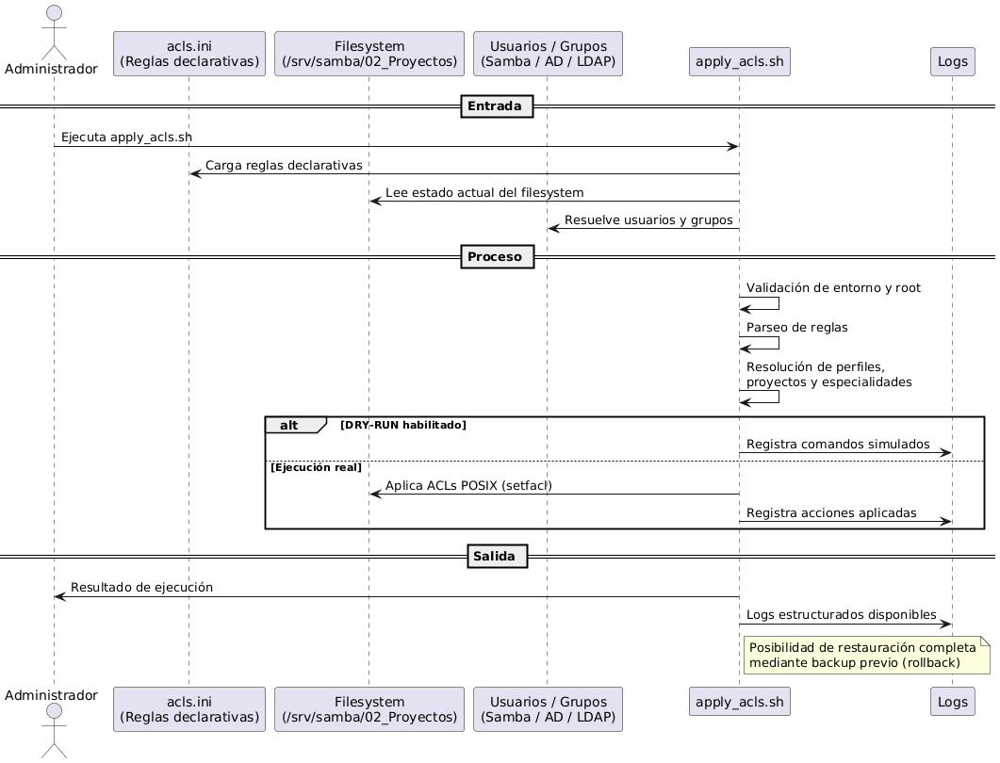

# Sistema Declarativo de Gestión de ACLs para Proyectos Samba

## 1. Propósito

Este repositorio implementa un **sistema declarativo, idempotente y auditable** para la gestión de permisos **ACL POSIX** sobre proyectos alojados en un servidor **Linux (Ubuntu)** con almacenamiento compartido vía **Samba**.

El propósito del sistema es **estandarizar y automatizar** la asignación de permisos por **perfil** y **proyecto**, eliminando la gestión manual basada en comandos `setfacl`, la cual generaba:

- alto riesgo de error humano,
- inconsistencias entre proyectos y servidores,
- baja trazabilidad,
- dificultad para auditoría y reversión de cambios.

El sistema está diseñado para ejecutarse de forma segura incluso cuando:
- existen proyectos sin estructura completa,
- algunas especialidades no están creadas aún,
- los usuarios o grupos provienen de **Samba, Active Directory o LDAP**,
- el script se ejecuta múltiples veces sin efectos acumulativos.

---

## 2. Descripción técnica

El sistema se basa en un **modelo declarativo deny-by-default**, donde los permisos se definen en archivos de configuración versionados y se aplican mediante un motor controlado.

### Principio de seguridad

> **“Lo que no edita, NO lo ve (ni lo lista, ni le aparece)”**

Este principio se implementa de la siguiente forma:

- Solo se otorgan permisos explícitos en carpetas declaradas como editables (`write`).
- En la carpeta `01_WIP`, los perfiles restringidos reciben únicamente permiso de tránsito (`--x`), sin capacidad de listado.
- Las carpetas no editables reciben ACL explícita `---`, eliminando permisos residuales.
- El perfil BIM es la única excepción, con visibilidad total del WIP.

### Alcance técnico

El sistema **solo puede operar** sobre el siguiente árbol de directorios:

```
/srv/samba/02_Proyectos
```

Existe una validación dura que aborta la ejecución si el `root` configurado no coincide exactamente con esta ruta.
Principio de seguridad

> **"Lo que no edita, NO lo ve (ni lo lista, ni le aparece)"**

Modelo **DENY-BY-DEFAULT**:

- Solo se otorgan permisos explícitos en carpetas declaradas como `write`.
- En `01_WIP`, los perfiles restringidos reciben **solo `x` (traverse)**.
- Las carpetas no editables reciben ACL explícita `---`.
- BIM es la única excepción con visibilidad total del WIP.
---

## Perfiles y permisos

| Perfil | Carpetas con visualización y edición |
|------|--------------------------------------|
| IND_A | A_ARQ, O_LEV, YAC_ACU, YPA_PAT, YPM_PTR, YSE_SEN, YSH_SGH |
| IND_E | E_EST, O_LEV |
| IND_YTP | YTP_TOP, A_ARQ, O_LEV, YAC_ACU, YPA_PAT, YPM_PTR, YSE_SEN, YSH_SGH, E_EST |
| IND_B | TODAS las carpetas del WIP |


## Reglas operativas

- Git **NUNCA** con `sudo`.
- Scripts ACL **SIEMPRE** con `sudo`.
- No modificar ACLs manualmente fuera del sistema.
- Flujo obligatorio: **backup → DRY-RUN → apply**.

---

## 3. Instrucciones de uso

### Backup (obligatorio)

Antes de cualquier ejecución se debe realizar un respaldo completo de ACLs:


```bash
sudo ./scripts/backup_restore_acl.sh backup \
  /srv/samba/02_Proyectos \
  /root/acl_before_$(date +%Y%m%d_%H%M).facl
```

### DRY-RUN (prueba)
Permite validar el impacto sin modificar permisos reales:
```bash
sudo DRY_RUN=1 ./scripts/apply_acls.sh
```
Durante el DRY-RUN se muestran los comandos setfacl que serían ejecutados, pero no se aplican cambios.


### Ejecución real
Una vez validado el DRY-RUN:
```bash
sudo ./scripts/apply_acls.sh
```

---

## Rollback

```bash
sudo ./scripts/backup_restore_acl.sh restore / /root/acl_before_YYYYMMDD_HHMM.facl
```
--------

## 4. Diagrama de secuencia (Entrada y salida)




--------------
## 5. Estructura del repositorio

```
SCR-ACLs_SMB/
├── config/
│   └── rules.d/
│       └── acls.ini
├── scripts/
│   ├── apply_acls.sh
│   └── backup_restore_acl.sh
├── logs/
│   └── apply_acls.log
└── README.md
```
