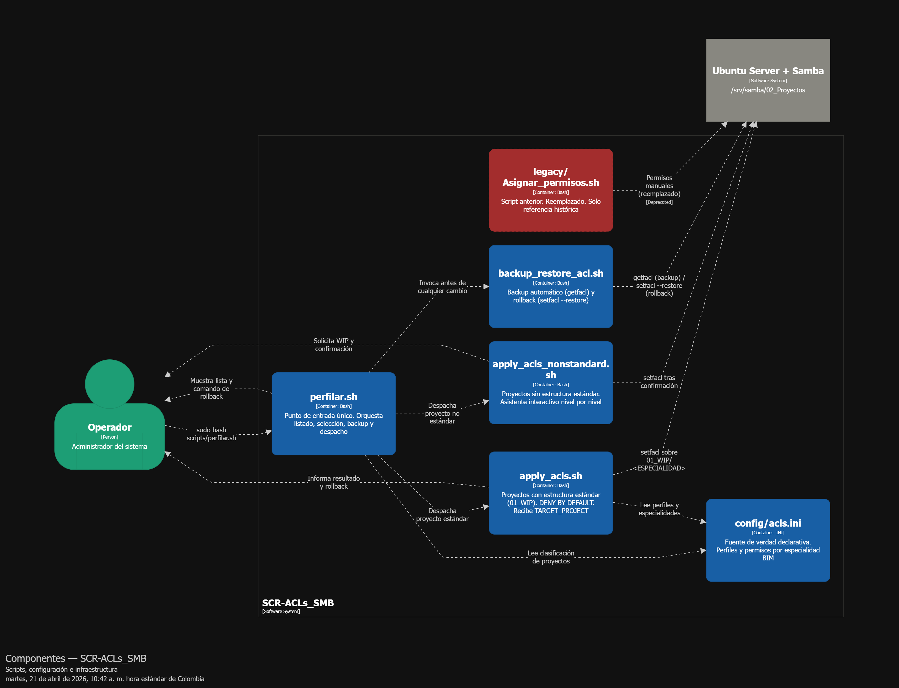

# Sistema Declarativo de Gestión de ACLs para Proyectos Samba

## 1. Propósito

Este repositorio implementa un sistema declarativo, idempotente y auditable para la gestión de permisos ACL POSIX sobre proyectos alojados en un servidor Linux (Ubuntu) con almacenamiento compartido vía Samba.

El propósito es estandarizar y automatizar la asignación de permisos por perfil y proyecto, eliminando la gestión manual basada en comandos `setfacl`, la cual generaba alto riesgo de error humano, inconsistencias entre proyectos y baja trazabilidad.

---

## 2. Descripción técnica

El sistema opera bajo un modelo **DENY-BY-DEFAULT**: todo acceso debe ser explícito. Lo no declarado queda sin permisos (`---`).

El árbol de directorios sobre el que opera es:

```
/srv/samba/02_Proyectos/<PROYECTO>/01_WIP/<ESPECIALIDAD>
```

**Proyectos con estructura estándar** (`01_WIP` en el primer nivel):
- Los permisos se definen en `config/acls.ini` por perfil y especialidad.
- Cada perfil obtiene `r-x` en la raíz, en el proyecto y en `01_WIP`.
- Las especialidades declaradas en `write` reciben `rwx` (dirs) / `rw-` (archivos).
- Las especialidades no declaradas reciben `---` explícito. Combinado con `hide unreadable = yes` en Samba, estas carpetas no aparecen en el explorador de Windows.
- El perfil BIM es la excepción: obtiene control total sobre el WIP (`wip_full_control`).

**Proyectos con estructura no estándar** (sin `01_WIP` en el primer nivel):
- El script navega el árbol nivel por nivel hasta que el usuario identifica la carpeta WIP equivalente.
- Se solicitan los permisos por grupo para cada subcarpeta.
- La configuración no se persiste: se aplica directamente tras confirmación.

Existe una validación dura que impide ejecutar los scripts fuera de `/srv/samba/02_Proyectos`.

---

## 3. Instrucciones de uso

El punto de entrada es `perfilar.sh`. Este script gestiona el flujo completo.

### Ejecutar la perfilación

```bash
sudo bash scripts/perfilar.sh
```

El script:
1. Lista los proyectos disponibles indicando si son estándar o no estándar.
2. El usuario selecciona el proyecto por número.
3. Muestra el proyecto seleccionado, su tipo de estructura y el script que se ejecutará.
4. Solicita confirmación antes de proceder.
5. Genera un backup automático de las ACLs actuales.
6. Ejecuta el script correspondiente según la estructura detectada.

### Revertir cambios (rollback)

Al finalizar, el script muestra el comando exacto para revertir si es necesario:

```bash
sudo bash scripts/backup_restore_acl.sh restore backups/acl_before_YYYYMMDD_HHMMSS.facl
```

---

### Flujo detallado — proyectos no estándar

Cuando `perfilar.sh` detecta que un proyecto no tiene `01_WIP` en el primer nivel, invoca `apply_acls_nonstandard.sh`. Este script recorre el árbol de carpetas en profundidad (DFS) de forma interactiva:

**En cada carpeta el script hace dos preguntas:**

1. **¿Quién puede EDITAR aquí?** — perfiles seleccionados reciben `rwx` en el directorio, `rwx` como ACL por defecto (archivos nuevos) y `rw-` en archivos existentes del nivel actual.

2. **De los restantes, ¿quién puede VER/ENTRAR?** — perfiles que no editan pero necesitan navegar la carpeta (por ejemplo, para llegar a una subcarpeta donde sí tienen permisos) reciben `r-x` en el directorio, `r-x` como ACL por defecto y `r--` en archivos del nivel actual.

Los perfiles no asignados en ninguna pregunta reciben `---` y la carpeta queda oculta en Windows vía `hide unreadable = yes` de Samba.

**Atajo recursivo:**

Después de cada selección, si la carpeta tiene subcarpetas el script las lista y pregunta:

```
¿Aplicar los MISMOS permisos a TODO lo que hay debajo? [s/n]
```

- `s` — aplica los permisos de forma recursiva sobre todo el subárbol sin seguir bajando.
- `n` — desciende a cada subcarpeta y repite la selección nivel por nivel.

**Vista previa y confirmación:**

Una vez recorrido el árbol completo, el script muestra todos los comandos `setfacl` que se ejecutarán (equivalente a un dry-run) y pide confirmación explícita (`yes`) antes de aplicar cualquier cambio.

**Resumen de tipos de permiso que genera el script:**

| Tipo | Directorios | Archivos | Efecto en Samba |
|------|------------|---------|-----------------|
| `WRITE_DIR` / `WRITE_REC` | `rwx` | `rw-` | Visible y editable |
| `READ_DIR` / `READ_REC` | `r-x` | `r--` | Visible, solo lectura |
| `DENY_DIR` / `DENY_REC` | `---` | `---` | Oculto (invisible) |

---

## 4. Diagramas
### Diagrama de componentes del sistema de gestión de ACLs


### Diagrama de secuencia (FLUJO 1) del sistema de gestión de ACLs

### Diagrama de secuencia (FLUJO 2) del sistema de gestión de ACLs

---

## 5. Estructura del repositorio

```
SCR-ACLs_SMB/
├── config/
│   └── acls.ini                    ← Declaración de perfiles y permisos (fuente de verdad)
├── scripts/
│   ├── perfilar.sh                 ← Punto de entrada principal
│   ├── apply_acls.sh               ← Permisos para proyectos con estructura estándar
│   ├── apply_acls_nonstandard.sh   ← Asistente nivel por nivel para estructura no estándar
│   └── backup_restore_acl.sh       ← Backup y rollback de ACLs
├── legacy/
│   └── Asignar_permisos.sh         ← Script anterior (reemplazado)
├── docs/
│   └── seq.png                     ← Diagrama de secuencia
├── BITACORA.md                     ← Registro de decisiones de diseño
└── README.md
```
